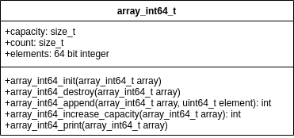
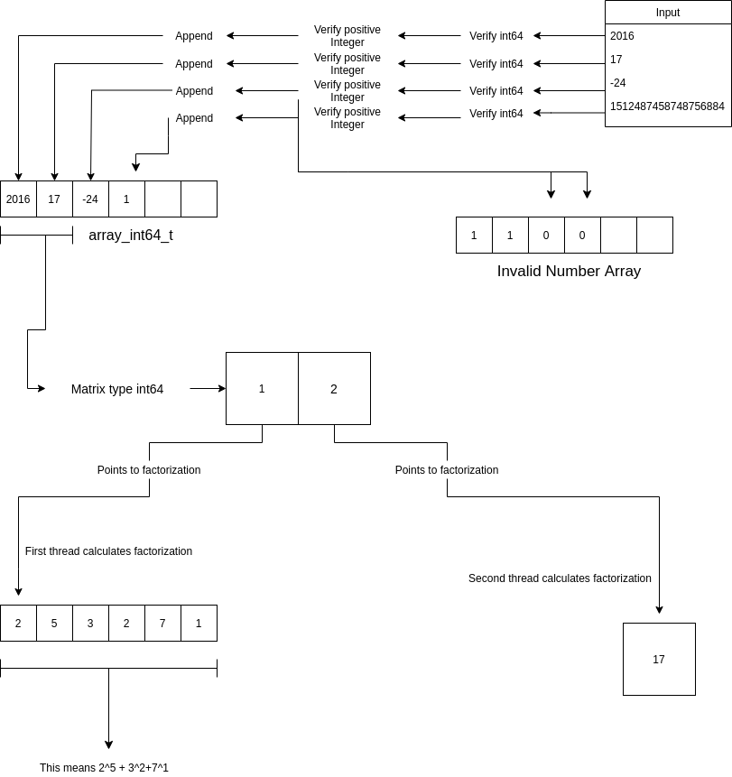

# Design

First, a data structure was created to store the desired values. The data structure is a dynamic array of type int64_t, to store only signed integers with no more than 64 bits. The diagram shows the methods that were done to implement the data structure.



After that we did the pseudo code to have a general idea of how the program should work and how to divide each task for it to be as optimized as possible. In the next diagram we can see a general idea of the algorithm that was created to calculate the prime factors correctly.



It's important to mention where the pthreads were used in the program. Every time we needed to calculate the prime factors of a number we used a thread for each number we had. We used a conditionally save aproach when implementing the algorithm for the pthread. This means that no thread will interfere with the work of another thread, never, they'll take and modify information from their own assigned space.There are various cases we needed to consider for the program to function correctly:

* More threads than numbers: In this case there are not enough numbers to be handled by each and every thread we have, so we just created the same number of threads as the numbers.
* More numbers than threads: in this case the worload had to be divided between the threads for the program to be efficient. One number was given to each thread, after every thread had one number we started again from the beginning, giving a number to a thread and so on until all the numbers were distributed.

After this, a ```main``` procedure was done to be the center and to call all other procedures.

Three arrays were created:

* values: Stores the values read from the file
* invalid numbers: in this list, if there's a 1 it means that the number in the same position as that 1, in the values array, is a valid number, if in the position has a 0, then the number is invalid or were characters.
* factors: factors is a dynamic memory array that stores various array_int64_t on it. This was done so that, for example, factors[1] has the prime factors of the value in values[1], in this order:

```bash
[factor, exponent, factor, exponent]
```

So for a value 2016

```bash
factors[1] = 2016
```

```bash
[2, 5, 3, 2,7,1]
```

Which indicates: $2^5 \cdot 3^2 \cdot 7$.

After that, we read the file and store the values in the array of values and the array of invalid numbers. We then proceed to calculate the prime factors of each value using threads (as mentioned before). Once the factors are calculated we print the results. For a more detailed explanation on the procedures done to read file, calculate the prime factors and print the results check the [documentation](../doc/html/index.html) or the internal documentation in the [source_code.](../src/primefact_serial.c)


[Click here to return to the README](../README.md)
