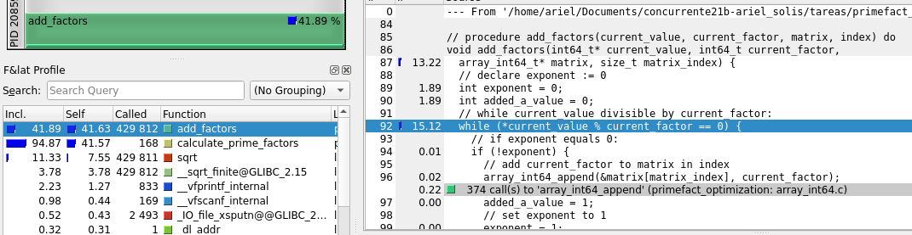
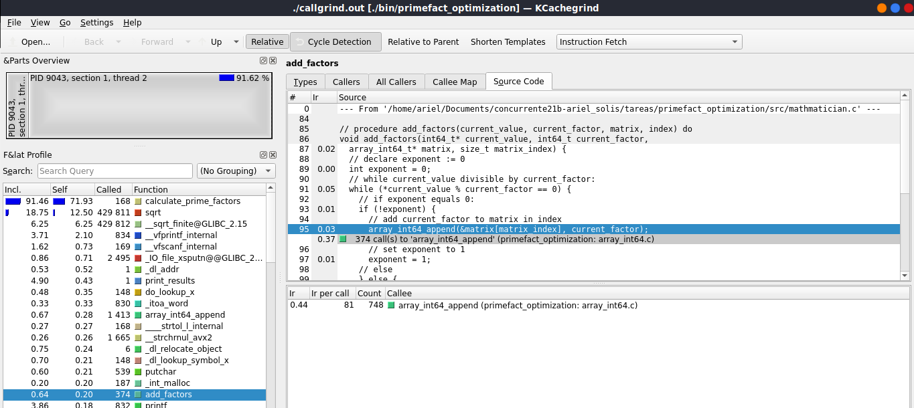
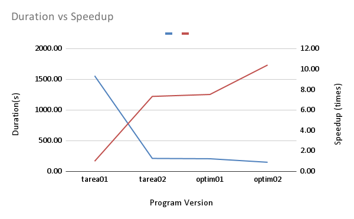
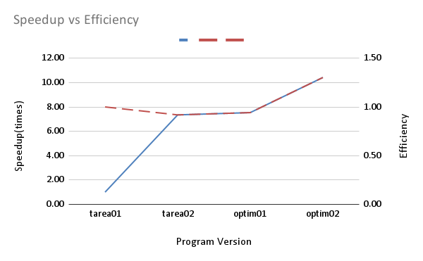
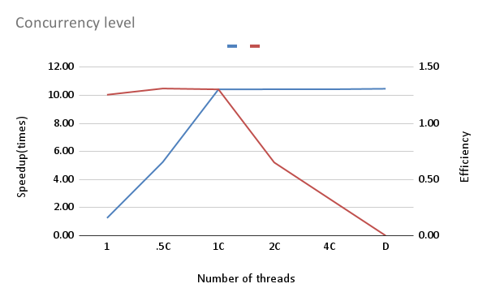

# Report

## First Optimization

The first optimization will be done with a dynamic mapping.

Dynamic mapping is a way of distributing the work load between the threads. The general idea of how it works is: we have a number of threads, we take those threads and give one unit of work for each one; the thread that finishes first goes on to take the next unit of work available and so on until there are no more units of work left.

Dynamic mapping seems like the best kind of mapping for this program, given that it will be used in general scenarios where the order of the numbers given to factorize is not known.

To implement the dynamic mapping a new method was created, called "distribute_work". This method does dynamic mapping by having a shared variable, called next_working_unit, which represents the index of the next number to be factorized. A mutex was used to protect this variable. A mutex is a concurrency control mechanism that allows only one thread to be in it when it's locked. So, each time the next working unit was assigned and constantly incremented, only one thread could do this at a time.

Once each thread had it's own working unit, each thread makes sure that it's unit is not out of range and then proceeds to factorize the number.

[Click here to see the pseudocode done for the implementation](../design/thread_manager.pseudo)

[Click here to see the implementation](../src/thread_manager.c)

## Second Optimization

For the second optimization an analysis had to take place. Using a tool called callgrind and kcachegrind, we analysed which parts of the code were the ones using the most porcentage of CPU in each run. In the next image we can see the results of the CPU usage after doing the first optimization:

Here we can see that the methods that uses the most CPU is calculate_prime_factors and add_factors, each using more than 41% of the CPU and combined sum more than 82% of the CPU used in running the program, followed by sqrt which is the next one with the most impact. To fix this, we looked at the implementation and firstly tried to fix the number of times sqrt was called. We implemented a solution for this, but quickly realized that the sqrt of the number changed with each iteration, thus, could not be reduced as much. We then proceeded to fix the number of times add_factors is called. With this, the fix was pretty simple. add_factors is a method called each time we have a possible factor, we send each number to add_factors and it determines if the number is a factor or not. To fix this we just calculated whether our number is divisible by the factor we are on, if it's divisible, we call add_factors. After doing this fix we checked callgrind and kcachegrind again and got the following:

Here we see that the optimization was successfull. The usage from add_factors was reduced from 41% to 0.20% and in general we see that the impact from calculate_prime_factors plus add_factors got reduced from almost 82% to almost 72%, a 10% reduction.

## Measuring time and taking test

To see if our optimizations showed benefits, a measure in execution speed and various test took place. For the tests we used a file with over 40000 numbers to be factorized. To measure time we used a clock inside the source code that measured the time it took for the threads to end the factorization. Timer starts just before the threads are created and ended as soon as the threads are joined. This had to be done this way because the dynamic data structure that is used can seem to make the program's execution last the same, even if it's done with more threads. The time is measured in seconds.

## Comparing Optimizations

To see if the optimizations did it's job and measure the level of optimization that had been done, we did 3 tests for each version of the program and saved the fastest of the 3. With this we calculated the speed up and the efficiency of each version of the program, the following graph sums up everything.

On the first graph, following the blue line, we can see how the speed gets lower and lower and we can have a more clearer picture of the optimizations done. Looking at the graph we see that the optimizations do as they promised, decreased the time of execution of the program for a very large test case. But on time, the effects are not as noticeable. If we see the results for the speed up, we can now determine and conclude that the optimizations done really generate a faster program, we can see that the line has a tendency to increase as the program becomes more optimized.

Now on the second graph we can see the efficiency of the program, and taking into a count that the number of threads used in this part for all measures were 8, we can conclude that the program does not waste resources or overuse resources, it's a very efficient program.

## Concurrency Comparation

To measure the level of the concurrency on the program, we did a number of tests, each with a different number of threads. In the next table we summarize how the tests were done:

| Legend | Description                       | Number of Threads |
|--------|-----------------------------------|-------------------|
| 1      | Serial version                    | 1                 |
| 0.5C   | Half of the CPUs available        | 4                 |
| 1C     | Number of CPUs available          | 8                 |
| 2C     | Double the number of CPUs         | 16                |
| 4C     | four times the number of CPUs     | 32                |
| D      | The number of numbers in the file | 40061             |

Now in the following graph we present the results of each test:

In the graph it's very noticeable that the program speeds up a lot, compared to the serial version. Looking at the line in blue (speed up) we can see that from having one or 4 threads it reaches it's peak at 8 threads and then the speed up does not change. This is because, on terms of time, the computer has only 8 CPUs, if we add more threads, the computer has to virtualize those other threads, resulting in a waste of resources for the computer. This can also be seeing in the efficiency (red line). The program is very efficient on the serial version and it gets an increment in efficiency when adding threads, but if we add more threads than CPUs, then the program becomes very unefficient because wastes a lot of resources creating the extra threads, until the efficiency becomes 0 when we have more than 40000 threads.
